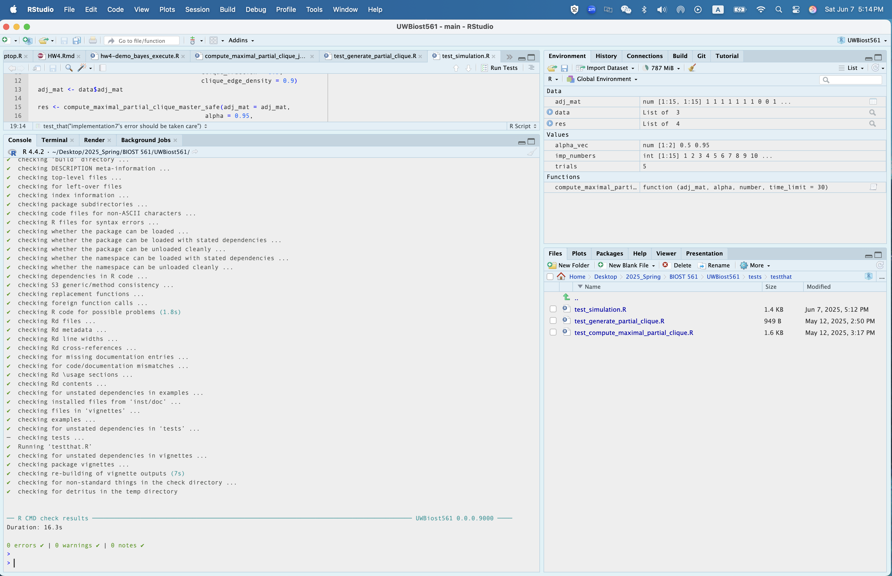
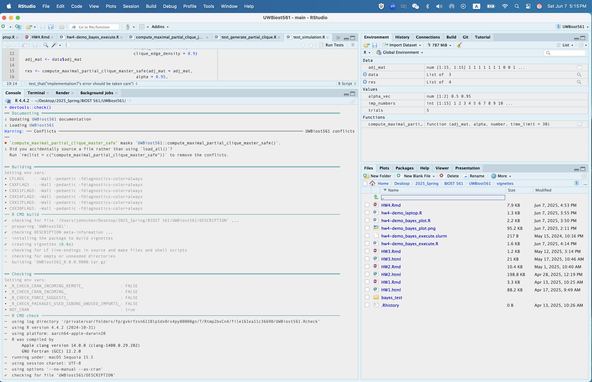
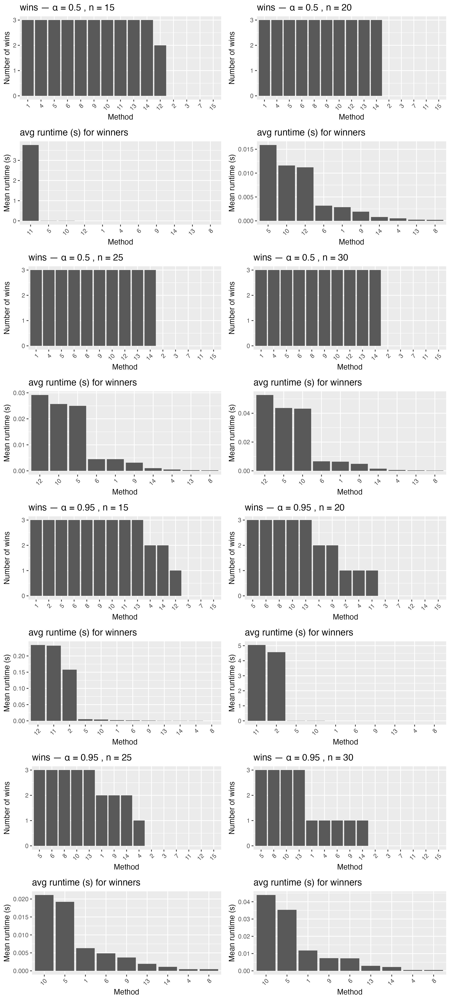

```{r, include = FALSE}
knitr::opts_chunk$set(
  collapse = TRUE,
  comment = "#>"
)
```


### Question 1B: Looking at two implementations you were given, summarize what you think the implementations are doing in one to four sentences each. (This is to practice reading other people’s code.)

Implementation4: 

First, it checks that the inputs are valid. Then it looks at each node’s number of connections and orders them from most to least. It builds a set by adding the highest-connection node one by one, each time checking if the group’s connections stay dense enough (at least alpha). It stops when adding another node would make the group too sparse.

Implementation6:

First, it checks that the adjacency matrix is a binary, symmetric matrix of size 5 to 50 with 1s on the diagonal and no row or column names, and that alpha is a single number between 0.5 and 1. Then for each node, it begins a clique with just that node and repeatedly tries adding any other node that keeps the group’s edge density at least alpha, stopping when no more nodes can be added. After growing a clique from each starting node, it picks the largest one found and calculates its edge density. Finally, it returns the sorted indices of that clique along with its density.


### Question 1C: In terms of coding clarity (i.e., not whether the code gives a good answer), are there recommendations you would give the original author of the code to improve their code’s clarity? This can be in documentation, variable naming, whether some code could have been factorized into their dedicated functions, if some portion of code was hard to understand, etc. Give none to two suggestions for each implementation. (You can give no suggestions if you thought the code was spectacular – even if it’s not returning a great answer, you can easily understand what the code does despite being written by someone else.)

For implementation4, it would help to move the code that calculates edge density into its own small function or at least give clearer variable names like `calc_density` rather than inline calculations. Also adding a brief comment before the degree-based ordering to explain the heuristic would make it easier for someone else to follow the logic.

For implementation6, you may pull out the repeated edge density calculation into a separate helper or add a comment before the inner `while` loop to explain that you’re greedily adding any node that keeps the density above alpha.

### Question 1D: In HW3, you wrote down at least 5 unit tests for your implementation of compute_maximal_partial_clique(). In this R Markdown file (i.e., not in your tests folder), copy-paste your 5 unit tests and see if the two compute_maximal_partial_clique implementations you were assigned pass your unit tests. If you were assigned implementations #2 and #7, you would test the functions compute_maximal_partial_clique2() and compute_maximal_partial_clique7().

They all passed, I assigned implementation 4 and 6 into "compute_maximal_partial_clique" so thats why it occurs like that. 

✔ | F W  S  OK | Context
✔ |          7 | compute_maximal_partial_clique                                                                                   
✔ |          7 | Testing generate_partial_clique                                                                                  

══ Results ═══════════════════════════════════════════════════════════════════════════════════════════════════════════════════════
[ FAIL 0 | WARN 0 | SKIP 0 | PASS 14 ]
✔ | F W  S  OK | Context
✔ |          7 | compute_maximal_partial_clique                                                                                   
✔ |          7 | Testing generate_partial_clique                                                                                  

══ Results ═══════════════════════════════════════════════════════════════════════════════════════════════════════════════════════
[ FAIL 0 | WARN 0 | SKIP 0 | PASS 14 ]

```{r}
# library(UWBiost561)
# library(testthat)
# 
# source("../R/compute_maximal_partial_clique4.R")
# compute_maximal_partial_clique <- compute_maximal_partial_clique4
# 
# test_dir("../tests/testthat")
# 
# source("../R/compute_maximal_partial_clique6.R")
# compute_maximal_partial_clique <- compute_maximal_partial_clique6
# test_dir("../tests/testthat")


```


### Question 2A: Please run the following code. If you cannot run it, something has gone wrong with your UWBiost561 package. (For instance, it might be because your generate_partial_clique() function does not work or is not correctly located in your R package.)

### Question 2B: Describe what you would like your simulation to study in a few sentences. Specifically, you are making a simulation plan (see Lecture 8 for details).

1. How are you generating the random graphs for your analysis? What qualities do those random graphs have? (You can use your generate_partial_clique() function, and then you would describe what kind of graph your generate_partial_clique() makes.)

I call generate_partial_clique(n = k, clique_fraction = 0.9, clique_edge_density = 0.9) to make each graph. 


2. How are you varying the random graphs across the different “levels” of your analysis? (For example, you can vary n, clique_fraction, clique_edge_density, and/or alpha. Your simulation study can focus on changing one or two values.)

I fix the clique size and density but change the total node count to 15, 20, 25, 30. I also run each graph twice, once with alpha = 0.5 and once with alpha = 0.95.


3. Which different methods are you using in your simulation study? (This question is moot for this homework since you’ll be using all 15 implementations of compute_maximal_partial_clique, but please write this down for thoroughness.)

I test every version of compute_maximal_partial_clique_master—all 15 implementations. This shows how different algorithms behave on the same data.

4. What do you hope to learn with your simulation study? Alternatively, what trends/patterns/results are you hoping to see?

I want to see how node count and alpha affect accuracy and speed. I expect that larger graphs and stricter alpha will slow methods down and maybe drop some true clique nodes. 

5. How many trials do you intend to run per “level”?

I will do 3 trials for each combination of node count and alpha. That gives enough repeatability without taking too long.

6. How much time do you estimate your simulation study will need at maximum? See Note 2 below.

Since in my opinion n=25 shouldn't be very computatonal heavy, only n=30 does, I expect them to successfully run within 30s except n=30. So 30s * 15 * 4 * 2 * 2 = 2h, but I believe it would be much less than that since n=10 finishes in like 10 minutes total (?)


### Question 2C: In your R folder, design a function that executes your intended simulation plan. (I am purposely being loose and very open-ended about designing this simulation regarding the inputs or outputs. In contrast to HW3, where everything was spelled out explicitly, I am now giving you the task of meaningfully designing the inputs/outputs.)

I decide to use the compute_maximal_partial_clique_master() function. I will use an addition n_vector to record n=15, 20, 25. Also, I find implementation 7 to report error: "Error in adj_mat[clique_idx, clique_idx] : subscript out of bounds" in some cases, and I am going to add a trycatch wrap for the mater function so the simulation wont terminate. 


### Question 2D: Create a few (more than one) unit tests for your simulation function. This unit test (like your unit tests in HW3) will be in your tests/testthat folder. I am also purposely vague about how many tests or what kind of unit tests to write. This is for you to decide! After all, you’re about to unleash your code to perform a (potentially long) simulation test, so you hope you’ve tested your simulation code well enough for this to be a good use of time.


### Question 2E:



### Question 3A: 

### Question 3B: 
### Question 3C:
### Question 3D: 
### Question 3E: 



## Q4: Describing your final project

I am going to use UWBiostat561 to build the pkdown. 
